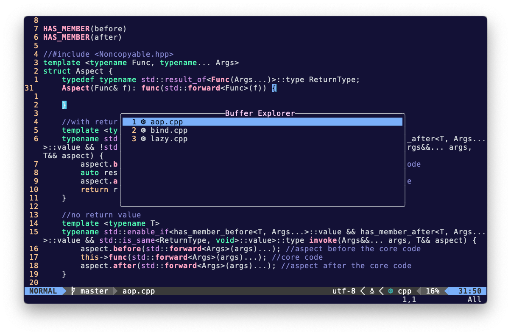

# A Buffer Explorer for neovim



Buffer Explorer plugin is a **highly customizable** plugin to display your current buffer list, and it allows you to make operations on buffers, like edit, delete or open in new tab, etc.

### Installation

lazy.nvim

```lua
{
  "xiaoqixian/buffer-explorer.nvim",
  dependencies = { 
    "nvim-lua/plenary.nvim",
    "nvim-tree/nvim-web-devicons"
  },
  lazy = false,
  init = require("plugins/buffer_explorer").init
} 
```

### How it Works

This plugin contains only two modules: menu and ui. 

The ui module manages the popup window, it creates a new window every time the windows is shown. 

The menu module manges a menu buffer, which is used to contain all contents to display in the menu. This buffer is not buflisted, and is alive the whole time the plugin is alive. On every display, the plugin will create new contents with the vim buffer list, and replace old contents in the menu buffer with the new contents. 

### Necessary Setting Up

This plugin cannot work without setting up. You need to call the `setup` function to set it up, just as the most other neovim plugins do.

If you just want to use the default configurations, you can just call the `setup` function with nothing. For example, 

```lua
-- in the plugin config file
-- which is plugins/buffer_explorer.lua, in my case.
local M = {}
function M.init()
  -- use colon instead of dot here.
  require("buffer_explorer"):setup()
end
return M
```

If you want to set some configurations, the config table has to follow the following structure:

```lua
local my_config = {
  -- the key name has to be the same.
  menu = {
    -- put menu configurations in this table
    config = {}
  },
  ui = {
    -- put ui configurations in this table
    config = {}
  }
}
```

For example, by default, the ui configuration is like this:

```lua
local defaults = {
  title = "Buffer Explorer",
  title_pos = "center",
  width = 60,
  height = 10,
  border = { "╭", "─", "╮", "│", "╯", "─", "╰", "│" },
  win_options = {
    cursorline = true,
    number = true
  }
}
```

If you want to override the width and the height of the popup window, you can set your config table as:

```lua
local my_config = {
  ui = {
    config = {
      width = 80,
      height = 15
    }
  }
}
```

The plugin will try to merge your config with the defaults, so the final config will be

```lua
ui.config = {
  title = "Buffer Explorer",
  title_pos = "center",
  width = 80,
  height = 15,
  border = { "╭", "─", "╮", "│", "╯", "─", "╰", "│" },
  win_options = {
    cursorline = true,
    number = true
  }
}
```

More specific configurations will be introduced in the following parts.

### Recomended configurations

This is my configurations:
```lua
local M = {}

function M.init()
  local be = require("buffer_explorer")
  local utils = require("buffer_explorer.utils")

  local menu = {
    config = {
      menu_keymaps = {
        ["<CR>"] = {
          op = utils.edit_buffer,
          desc = "edit buffer on the cursorline"
        },
        ["q"] = {
          op = function() 
            be:close()
          end,
          desc = "close buffer explorer"
        },
        ["<ESC>"] = {
          op = function() 
            be:close()
          end,
          desc = "close buffer explorer"
        },
        ["t"] = {
          op = utils.tabnew_buffer,
          desc = "open buffer in a new tab"
        },
        ["d"] = {
          op = utils.delete_buffer,
          desc = "delete a buffer"
        },
        ["D"] = {
          op = utils.force_delete_buffer,
          desc = "force delete a buffer"
        },
        ["e"] = {
          op = utils.toggle_buf_name,
          desc = "toggle buffer name"
        },
        ["i"] = {
          op = utils.sp_buffer,
          desc = "open buffer in a horizontal window"
        },
        ["s"] = {
          op = utils.vs_buffer,
          desc = "open buffer in a vertical window"
        }
      },

      -- set menu buffer local highlights
      highlights = {
        -- the key is also the name of 
        -- the highlighting group.
        ModifiedBuffer = {
          ctermfg = 3,
          bold = true
        },
      },
    }
  }

  be:setup({
    menu = menu
  })
  
  vim.keymap.set("n", "<leader>x", 
    function()
      be:toggle()
    end, 
    {
      noremap = true,
      nowait = true,
      desc = "toggle buffer explorer",
      silent = true
    })
end

return M
```

### Functions

The plugin provide the following functions to operate the buffer menu, i.e., the buffer list window. 

- `open`: open the menu window
- `close`: close the menu window
- `toggle`: toggle the menu window

By default, the plugin does not set any key mapping. So if you need one, you can set it in your own config file. For example,

```lua
function M.init()
  local be = require("buffer_explorer")
  be:setup()
  vim.keymap.set("n", "<leader>x", 
    function()
      be:toggle()
    end, 
    {
      noremap = true,
      nowait = true,
      desc = "toggle buffer explorer",
      silent = true
    })
end
```

### Buffer Operations

The plugin also provides some default functions to operate buffers, they are in the utils module, you can require them by `require("buffer_explorer.utils")`

- `edit_buffer`: enter the buffer on the cursor line;
- `tabnew_buffer`: open the buffer on the cursor line in a new tab;
- `delete_buffer`: delete the buffer on the cursor line, fails if the buffer is modified;
- `force_delete_buffer`: force delete the buffer on the cursor line.
- `toggle_buf_name`: toggle the buffer full path name and the file name on the cursor line.

Notice that these functions assume that the current buffer is the menu buffer. If the assumption is not satisfied, undefined behaviors may occur.

Also, the plugin does not provide any default key mapping for these functions. However, as these functions are buffer local functions, the plugin provide a way to set menu keymaps in the config file. Here's how:

```lua
local utils = require("buffer_explorer.utils")
local my_config = {
  menu = {
    config = {
      menu_keymaps = {
        ["<CR>"] = {
          op = utils.edit_buffer,
          desc = "edit curr buffer"
        }
      }
    }
  }
}
```

`menu_keymaps` is a key-value pair table, the plugin uses its key as the actual mapped key, and the value.op as the function to be invoked when that key is triggered. 

### Menu Highlights

By default, the plugin provides only one highlight group, which is "ModifiedBuffer". It highlights modified buffer line. To enable this, you have to set the highlight options for this hl group. Here's how:

```lua
local my_config = {
  menu = {
    cnofig = {
      highlights = {
        ModifiedBuffer = {
          ctermfg = 3,
          bold = true
        }
      }
    }
  }
}
```

The `highlights` table uses the hl group name as its key, and the corresponding highlight options as its value. You can refer [`nvim_set_hl`](https://neovim.io/doc/user/api.html#nvim_set_hl()) to check all available highlight options.

### Deep Customizations

As I've said above, this plugin is highly customizable, which means you can literally **override** anything in the plugin, including all options and functions. Only if you understand what you're doing. 

For example, you may want the menu to only display buffers whose paths are under the current project directory. Then you can override the default `buf_filter(bufnr)` function, which is used to filter which buffers to display. If it returns true, then the buffer will be put on the buffer menu, otherwise it won't be. By default it only filters buffers that not `buflisted`. 

To override this function, you can set:

```lua
local function my_buf_filter(bufnr)
  local proj_dir = vim.loop.cwd()
  local buf_name = vim.api.nvim_buf_get_name(bufnr)
  if buf_name:match(proj_dir) then
    return true
  end 
  return false
end
local my_config = {
  menu =  {
    buf_filter = my_buf_filter
  }
}
```

You can override all other functions as well, but you have to understand these functions first. 
